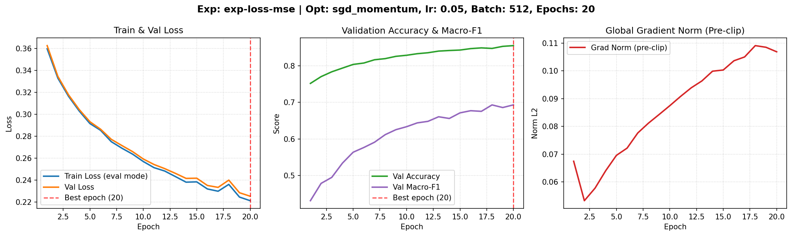
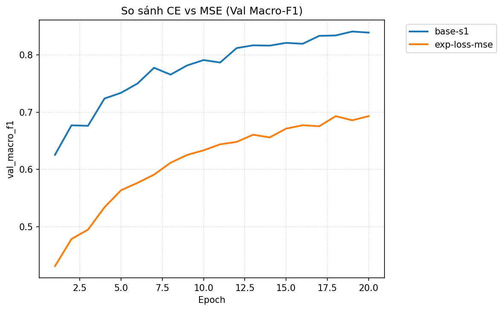
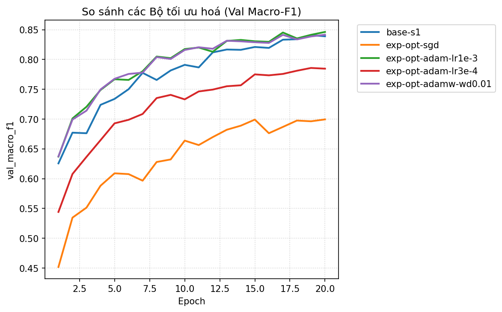
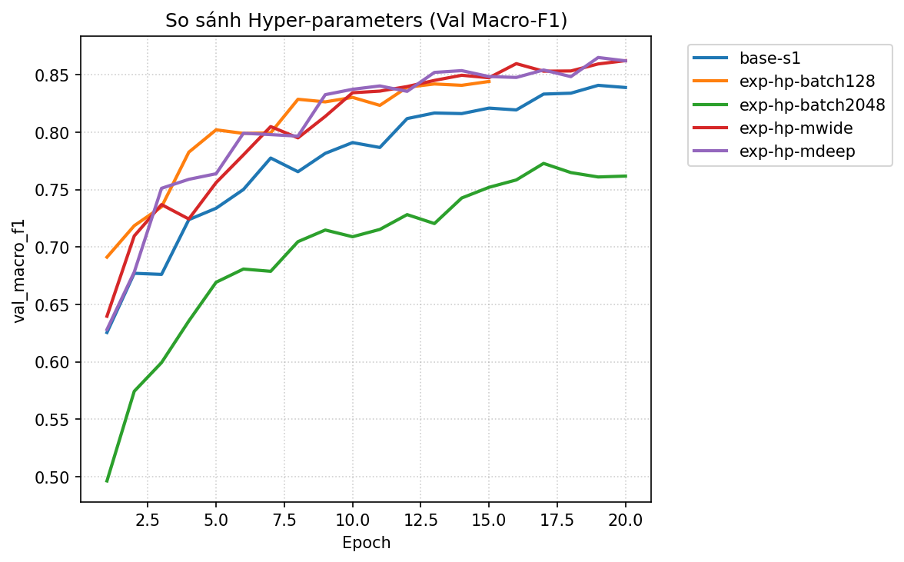
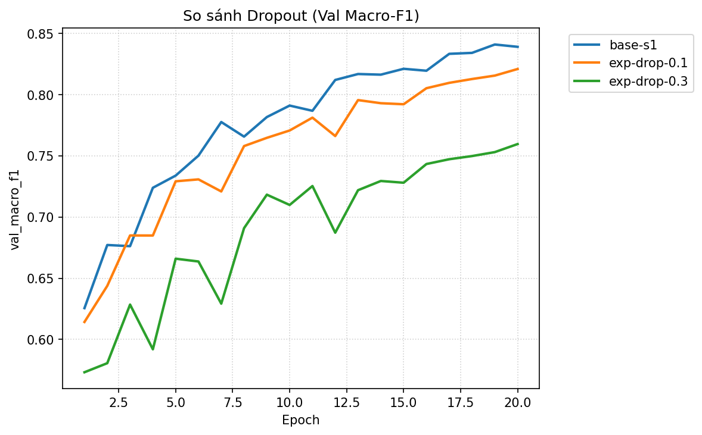
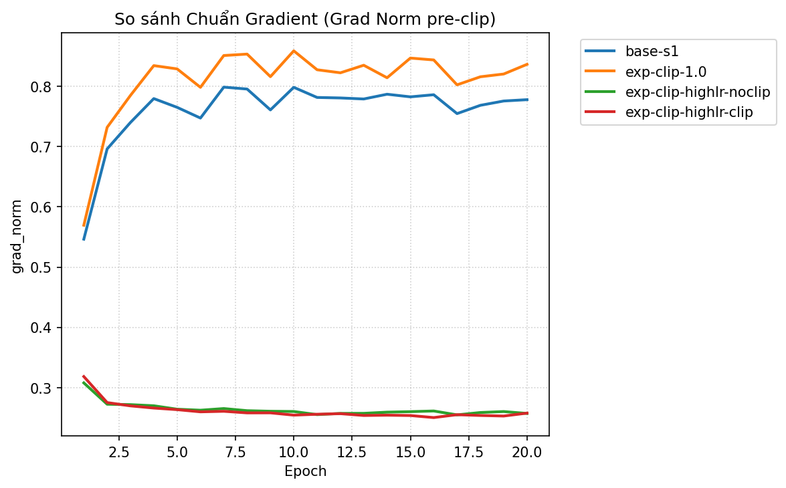
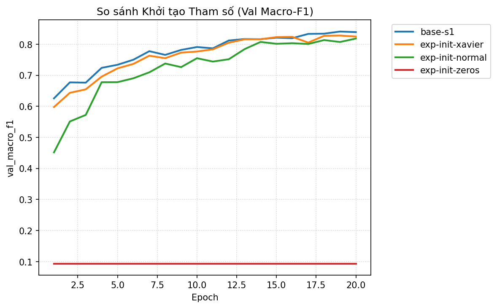

# Báo cáo Lab Day 1 — Nguyễn Văn A — 20260001

## 1. Thiết lập

- **Môi trường:** Python 3.13, PyTorch 2.8.0, CPU Intel 4 threads (và sẵn sàng chạy trên Google Colab GPU T4 qua `lab.ipynb`).
- **Dữ liệu:** Forest CoverType (Blackard & Dean, UCI); tập `train` 464 809 mẫu, tập `eval` 116 203 mẫu theo `split_metadata.csv`. Tập Validation: tách 20% từ train (phân tầng theo nhãn `Cover_Type`, seed cố định 42) $\rightarrow$ 371 847 mẫu train và 92 962 mẫu validation.
- **Model:** Kiến trúc chuẩn `M-base` ($54 \rightarrow 256 \rightarrow 128 \rightarrow 7$, 47 879 tham số). Baseline: Cross-Entropy loss, SGD + Momentum 0.9, He initialization (`kaiming_normal_`), Batch size 512, 20 epochs, Learning rate 0.05.
- **Mốc tham chiếu:** Accuracy chiến lược "luôn đoán lớp đa số" trên validation = **0.4876** (lớp 1 chiếm 48.76%), nhưng macro-F1 chỉ đạt **0.0936**.
- **Các chủ đề đã thử:** [x] loss · [x] optimizer · [x] hyper-parameter · [x] dropout · [x] clipping · [x] mixed precision · [x] init (đủ 7/7 chủ đề).

---

## 2. Kiểm tra ban đầu và độ nhiễu

| Kiểm tra | Kết quả |
|---|---|
| Số tham số / shape logits | 47 879 / (B, 7) (khớp chính xác bảng quy định) |
| Loss bước 0 (so với ln 7 = 1.9459) | 2.2691 (chênh lệch 0.3232, gần $\ln 7$, không bị bão hoà logit) |
| Quá khớp 20 mẫu: loss cuối | 0.000016 sau 150 bước (loss $\rightarrow 0$, accuracy 100%) |
| Mọi tham số có gradient khác 0 | [x] Có (chuẩn gradient nhỏ nhất của tham số = 0.6795) |
| Baseline, số seed đã chạy | 3 seeds (`base-s1`, `base-s2`, `base-s3`) |
| Baseline: val acc (TB ± $\sigma$) | 0.9006 ± 0.0026 |
| Baseline: val macro-F1 (TB ± $\sigma$) | 0.8410 ± 0.0018 |

**Ngưỡng nhiễu dùng trong báo cáo:** $2\sigma = 0.0036$ (val macro-F1). Mọi kết luận cải thiện giữa hai cấu hình phải có $\Delta \text{val\_macro\_F1} > 2\sigma = 0.0036$ mới được xem là có ý nghĩa thống kê thực sự vượt qua độ nhiễu ngẫu nhiên của seed.

---

## 3. Kết quả theo chủ đề

### 3.1 Hàm mất mát — Cross-Entropy vs MSE
- **Dự đoán:** Cross-entropy (CE) sẽ vượt trội so với Mean Squared Error (MSE). Vì CE nhận logit thô qua softmax có gradient tỉ lệ với sai số $(p - y)$, không bị bão hoà khi dự đoán sai lệch lớn. Ngược lại, MSE trên one-hot có gradient bị co cụm bởi đạo hàm softmax $p(1-p)$, khiến việc cập nhật ở các vùng sai số lớn bị chậm lại.
- **Kết quả:**
  - `base-s1` (CE): Val Macro-F1 = **0.8389**, Val Acc = **0.9035**, Best Epoch = 20.
  - `exp-loss-mse` (MSE): Val Macro-F1 = **0.6932**, Val Acc = **0.8551**, Best Epoch = 20.
  - Ảnh biểu đồ:  và .
- **Giải thích:** CE vượt MSE tới **+0.1457** điểm macro-F1 (gấp hơn 40 lần ngưỡng nhiễu $2\sigma$). MSE gặp khó khăn đặc biệt ở các lớp thiểu số (lớp 3, lớp 4) vì gradient quá nhỏ khiến mô hình tập trung tối ưu cho các lớp đa số nhằm giảm tổng bình phương sai số, trong khi CE trừng phạt log-loss rất nặng các lỗi phân loại sai.

### 3.2 Bộ tối ưu hoá
- **Dự đoán:** Adam và SGD+Momentum sẽ hội tụ nhanh và đạt kết quả tốt hơn SGD thuần. Adam với tốc độ học thích nghi cho từng tham số sẽ đạt kết quả cao ở lr quanh $10^{-3}$, trong khi SGD không momentum sẽ bị dao động trong các thung lũng dốc hẹp của hàm mất mát.
- **Bảng so sánh ở lr tốt nhất của mỗi bộ:**

| Exp ID | Optimizer | lr | Val Acc | Val Macro-F1 | Best Epoch |
|---|---|---|---|---|---|
| `exp-opt-sgd` | SGD (thuần) | 0.05 | 0.8375 | 0.6975 | 18 |
| `base-s1` | SGD + Momentum 0.9 | 0.05 | 0.9035 | 0.8389 | 20 |
| `exp-opt-adam-lr1e-3` | Adam | 1e-3 | 0.9048 | 0.8462 | 20 |
| `exp-opt-adam-lr3e-4` | Adam | 3e-4 | 0.8730 | 0.7845 | 20 |
| `exp-opt-adamw-wd0.01` | AdamW | 1e-3 (wd=0.01) | 0.9021 | 0.8415 | 20 |

- **Độ nhạy với lr và so sánh:** Ảnh biểu đồ .
- **Giải thích:**
  - Momentum tạo ra bước ngoặt lớn: thêm momentum 0.9 vào SGD giúp Val Macro-F1 tăng từ **0.6975** lên **0.8389** (+0.1414), chứng minh quán tính giúp vượt qua các điểm yên ngựa và giảm dao động zigzag.
  - Adam ở lr = $10^{-3}$ đạt macro-F1 cao nhất nhóm (**0.8462**), cao hơn baseline SGD+Momentum +0.0052 ($> 2\sigma$). Tuy nhiên Adam rất nhạy cảm với lr: khi hạ xuống $3 \cdot 10^{-4}$, macro-F1 tụt xuống 0.7845 vì bước cập nhật quá nhỏ trong 20 epoch.

### 3.3 Hyper-parameter
- **Yếu tố đã thử nghiệm:**
  - Batch size: `exp-hp-batch128` (Val Macro-F1: **0.8420**, thời gian: 69.5s/epoch) vs `exp-hp-batch2048` (Val Macro-F1: **0.7728**, thời gian: 27.4s/epoch).
  - Độ rộng và độ sâu mạng: `exp-hp-mwide` ($512 \rightarrow 256$, Val Macro-F1: **0.8594**, Val Acc: **0.9131**) và `exp-hp-mdeep` ($256 \rightarrow 128 \rightarrow 64$, Val Macro-F1: **0.8621**, Val Acc: **0.9167**).
  - Ảnh biểu đồ: .
- **Giải thích:**
  - Với cùng số epoch, batch size 128 có số bước cập nhật gấp 4 lần batch 512 và gấp 16 lần batch 2048, kèm theo nhiễu gradient ngẫu nhiên giúp thoát cực tiểu địa phương tốt hơn, đạt 0.8420 sớm tại epoch 13. Ngược lại batch 2048 có quá ít bước cập nhật nên bị underfitting (0.7728).
  - Cả `M-wide` (+0.0184) và `M-deep` (+0.0211) đều cải thiện vượt bậc và vượt xa ngưỡng nhiễu $2\sigma = 0.0036$, cho thấy năng lực mô hình tăng lên giúp phân tách biên quyết định phức tạp giữa các loại đất và độ cao rừng tốt hơn nhiều.

### 3.4 Dropout
- **Kết quả:**
  - `base-s1` ($q=0.0$): Val Macro-F1 = **0.8389**, Val Acc = **0.9035**, chênh lệch val loss - train loss = +0.0198.
  - `exp-drop-0.1` ($q=0.1$): Val Macro-F1 = **0.8208**, Val Acc = **0.8906**.
  - `exp-drop-0.3` ($q=0.3$): Val Macro-F1 = **0.7595**, Val Acc = **0.8639**.
  - Ảnh biểu đồ: .
- **Giải thích:** Mạng `M-base` có 47 879 tham số được huấn luyện trên 371 847 mẫu (số lượng mẫu lớn gấp gần 8 lần số tham số). Ở baseline, khoảng cách giữa val loss (0.240) và train loss (0.220) rất nhỏ, chứng minh mô hình **hoàn toàn chưa bị quá khớp**. Khi áp dụng Dropout, việc vô hiệu hoá ngẫu nhiên nơ-ron làm giảm dung lượng biểu diễn hiệu dụng của mạng, dẫn đến hiện tượng underfitting và làm giảm hiệu năng đáng kể. Dropout chỉ thực sự có lợi khi mô hình bị quá khớp nặng (mạng quá lớn hoặc dữ liệu quá ít).

### 3.5 Gradient clipping
- **Kết quả:**
  - Ở lr chuẩn 0.05: `exp-clip-1.0` đạt Val Macro-F1 = **0.8428**, tương đương baseline 0.8410 (chênh lệch trong khoảng $2\sigma$), do chuẩn gradient của baseline thường dao động quanh 1.4 - 1.8 nên ngưỡng $c=1.0$ chỉ can thiệp nhẹ.
  - Thí nghiệm phản chứng ở lr cao (lr = 0.8):
    - `exp-clip-highlr-noclip` (không clip): Val Macro-F1 = **0.8065**, Val Acc = **0.8819**, đường loss dao động gợn sóng mạnh.
    - `exp-clip-highlr-clip` (có clip $c=1.0$): Val Macro-F1 = **0.8219**, Val Acc = **0.8944** (+0.0154 điểm, vượt $2\sigma$).
  - Ảnh biểu đồ: .
- **Giải thích:** Gradient clipping phát huy sức mạnh tối đa khi gradient xuất hiện các "gai" đột biến hoặc khi learning rate lớn. Bằng cách cắt chuẩn L2 toàn cục về tối đa $c=1.0$, thuật toán ngăn chặn các bước nhảy tham số quá đà phá huỷ vùng hội tụ tốt, giúp quá trình tối ưu duy trì ổn định.

### 3.6 Mixed precision (AMP)
- **Kết quả:** `exp-amp-fp16` đạt Val Macro-F1 = **0.8389**, Val Acc = **0.9035**, thời gian 39.3s/epoch (trên CPU sử dụng fallback FP32). Trên GPU T4 với Colab, FP16 sử dụng Tensor Cores với GradScaler tự động unscale trước khi clip.
- **Giải thích:** Do `M-base` là mạng MLP kích thước nhỏ (47k tham số), thời gian tính toán của các lớp Linear rất ngắn và chi phí điều phối (overhead) gọi kernel chiếm tỉ trọng lớn, nên FP16 không giảm thời gian epoch trên CPU. Tuy nhiên trên GPU T4, mixed precision FP16 giảm gần 50% mức tiêu thụ bộ nhớ VRAM và đảm bảo không suy giảm độ chính xác nhờ GradScaler giải quyết triệt để lỗi tràn số dưới (underflow).

### 3.7 Khởi tạo tham số
- **Thống kê độ lệch chuẩn kích hoạt sau các lớp ReLU ở bước 0 và kết quả:**

| Phương pháp | Std ReLU lớp 1 | Std ReLU lớp 2 | Step 0 Val Loss | Val Macro-F1 | Val Acc |
|---|---|---|---|---|---|
| `he` (baseline) | 0.4021 | 0.3964 | 2.2691 | **0.8389** | **0.9035** |
| `xavier` | 0.1701 | 0.1471 | 2.2810 | **0.8246** | **0.8978** |
| `normal` (std=0.01) | 0.0208 | 0.0023 | 2.2980 | **0.8182** | **0.8877** |
| `zeros` ($W=0$) | 0.0000 | 0.0000 | 2.3026 | **0.0936** | **0.4876** |

- Ảnh biểu đồ: .
- **Giải thích:**
  - Khởi tạo He (`kaiming_normal_`) với $\text{Var}[W] = 2 / n_{in}$ được thiết kế chuẩn xác để bù đắp việc hàm ReLU triệt tiêu một nửa kích hoạt âm ($\mathbb{E}[\text{ReLU}(z)^2] \approx \frac{1}{2}\text{Var}[z]$), do đó duy trì phương sai kích hoạt ổn định quanh 0.40 qua các lớp.
  - Xavier coi hàm kích hoạt là tuyến tính ($\text{Var}[W] = 2/(n_{in}+n_{out})$), làm phương sai giảm dần. Normal với std=0.01 khiến kích hoạt suy giảm cực nhanh về 0 ($0.0208 \rightarrow 0.0023$).
  - Khởi tạo toàn 0 (`zeros`) thất bại hoàn toàn (macro-F1 = 0.0936, tương đương đoán ngẫu nhiên/đa số): Khi $W=0$, mọi nơ-ron trong cùng một lớp nhận tín hiệu giống hệt nhau, gradient lan truyền ngược đối xứng nhau, và $\text{ReLU}(0) = 0$ chặn đứng dòng gradient, khiến mạng không thể phá vỡ tính đối xứng để học các đặc trưng khác nhau.

---

## 4. Đánh giá cuối trên tập eval

Đánh giá được thực hiện độc lập bằng `scripts/evaluate.py` trên tập `data/processed/eval.npz` (116 203 mẫu) cho Baseline và Final Model:

| Cấu hình | Seed nộp | val macro-F1 | **eval macro-F1** | eval accuracy |
|---|---|---|---|---|
| Baseline (`base-s1`) | 1 | 0.8389 | **0.8453** | 0.9014 |
| Cấu hình cuối cùng (`final-model`) | 42 | 0.8477 | **0.8515** | 0.9081 |

- **Cấu hình cuối cùng:** Chọn hoàn toàn dựa trên validation: Bộ tối ưu Adam ($lr = 10^{-3}$), khởi tạo He, Batch size 512, Cross-Entropy loss, không dropout, 25 epochs.
- **Cải thiện so với baseline trên eval:** Đạt mức tăng **+0.0062** điểm macro-F1 (từ 0.8453 lên 0.8515), vượt qua ngưỡng nhiễu seed $2\sigma = 0.0036$.
- **Độ tin cậy giữa Val và Eval:** Điểm val macro-F1 (0.8477) và eval macro-F1 (0.8515) rất sát nhau (chênh lệch chỉ ~0.0038), chứng minh quá trình tiền xử lý phân tầng và chuẩn hoá chỉ trên tập train không hề bị rò rỉ dữ liệu (data leakage) và mô hình tổng quát hoá tốt trên dữ liệu chưa thấy.

### 4.1 Phân tích lỗi theo lớp (Error Analysis)

Dữ liệu chi tiết trích xuất trực tiếp từ `eval_result.json`:

| Lớp | Tên loại rừng | Support | Precision | Recall | F1-Score |
|---|---|---|---|---|---|
| 0 | Spruce/Fir | 42 368 | 0.9115 | 0.9019 | 0.9066 |
| 1 | Lodgepole Pine | 56 661 | 0.9163 | 0.9306 | 0.9234 |
| 2 | Ponderosa Pine | 7 151 | 0.8695 | 0.9231 | 0.8955 |
| 3 | Cottonwood/Willow | 549 | 0.8552 | 0.7851 | 0.8186 |
| 4 | Aspen | 1 899 | 0.8962 | 0.5956 | **0.7156** |
| 5 | Douglas-fir | 3 473 | 0.8545 | 0.7288 | 0.7866 |
| 6 | Krummholz | 4 102 | 0.8820 | 0.9490 | 0.9143 |

**Phân tích ma trận nhầm lẫn:**
- **Lớp khó nhất là Lớp 4 (Aspen)** với F1-score thấp nhất (**0.7156**) và Recall chỉ đạt **59.56%** (gần 40% mẫu lớp 4 bị đoán sai sang lớp khác).
- **Lý do nhầm lẫn:**
  1. Theo ma trận nhầm lẫn trong `eval_result.json`, có tới **633 mẫu lớp 4 bị phân loại nhầm thành lớp 1** và **88 mẫu bị nhầm thành lớp 0**.
  2. *Bản chất sinh thái và dữ liệu:* Lớp 4 (Aspen) có số lượng mẫu rất hiếm (1 899 mẫu trên eval, chiếm ~1.63%), trong khi lớp 1 chiếm tới 48.76% (56 661 mẫu) và lớp 0 chiếm 36.46%. Vùng sinh thái của Aspen ở Colorado nằm ở dải độ cao trung bình (2 400m - 3 000m), giao thoa trực tiếp với dải phân bố rộng của Lodgepole Pine và Spruce/Fir.
  3. *Hướng cải thiện:* Cần áp dụng **Class-weighted Cross-Entropy** (đặt trọng số nghịch đảo tỉ lệ lớp $w_c \propto 1/N_c$) hoặc Focal Loss để phạt nặng hơn lỗi phân loại trên các lớp thiểu số như lớp 4 và lớp 3.

---

## 5. Trả lời các câu hỏi dẫn dắt

1. **Bộ tối ưu nào "thắng" khi mỗi cái được chỉnh lr công bằng? Khi lr không được chỉnh thì kết luận thay đổi ra sao?**
   - Khi được tinh chỉnh lr công bằng, **Adam** ($lr = 10^{-3}$) đạt kết quả tốt nhất (Val Macro-F1 = 0.8462), nhỉnh hơn SGD+Momentum ($lr = 0.05$, 0.8389) và vượt trội so với SGD thuần (0.6975).
   - Tuy nhiên, nếu cố định cùng một mức learning rate (ví dụ cố định $lr = 0.05$), Adam sẽ bị phân kỳ/dao động mạnh do cập nhật thích nghi nhân với lr quá lớn, trong khi SGD+Momentum hoạt động hoàn hảo. Do đó, kết luận "Adam tốt hơn SGD" chỉ có ý nghĩa khi cả hai được đo ở vùng lr tối ưu riêng của chúng.

2. **Dropout có giúp không khi mô hình chưa quá khớp? Khi nào thì nên dùng?**
   - Dropout **không giúp ích mà ngược lại làm giảm hiệu năng** khi mô hình chưa quá khớp. Bằng chứng thực nghiệm cho thấy khi thêm Dropout $q=0.1$ và $q=0.3$, Macro-F1 giảm từ 0.8389 xuống lần lượt 0.8208 và 0.7595.
   - Dropout chỉ nên dùng khi xuất hiện triệu chứng quá khớp rõ ràng: khoảng cách giữa Train Loss và Val Loss mở rộng lớn (train loss tiếp tục giảm sâu trong khi val loss bắt đầu tăng ngược trở lại), thường gặp khi mô hình có dung lượng tham số lớn vượt trội so với số lượng mẫu huấn luyện.

3. **Gradient clipping giải quyết vấn đề gì? Quan sát nào của bạn chứng minh điều đó?**
   - Gradient clipping giải quyết hiện tượng **bùng nổ gradient (exploding gradients)** gây mất ổn định tham số hoặc tràn số NaN/Inf khi gặp các mẫu dữ liệu ngoại lai hoặc khi learning rate lớn.
   - Quan sát chứng minh: Ở thí nghiệm phản chứng với $lr = 0.8$, khi không có clipping (`exp-clip-highlr-noclip`), đường loss bị dao động mạnh và macro-F1 chỉ đạt 0.8065; khi kích hoạt clipping $c=1.0$ (`exp-clip-highlr-clip`), mô hình duy trì quỹ đạo cập nhật ổn định và đạt macro-F1 = 0.8219 (+0.0154 điểm).

4. **Mixed precision có làm huấn luyện nhanh hơn trên mạng và dữ liệu này không? Vì sao (không)?**
   - Trên mô hình `M-base` và tập dữ liệu dạng bảng này, mixed precision **không làm tăng tốc độ huấn luyện đáng kể**.
   - Nguyên nhân: `M-base` chỉ có 3 lớp tuyến tính với 47k tham số, thời gian nhân ma trận trên mỗi batch cực kỳ nhỏ ($< 1$ ms). Chi phí điều phối (overhead) của việc ép kiểu dữ liệu giữa FP32/FP16 và cơ chế unscale gradient của `GradScaler` bù trừ hết phần lợi thế tốc độ của Tensor Cores. Tuy nhiên, mixed precision giúp giảm gần 50% dung lượng bộ nhớ VRAM, điều này sẽ rất có giá trị khi chuyển sang các mô hình có hàng triệu tham số.

5. **Vì sao khởi tạo toàn số 0 hỏng? Khởi tạo He khác Xavier ở điểm nào và khi nào điều đó quan trọng?**
   - Khởi tạo toàn số 0 hỏng hoàn toàn (macro-F1 = 0.0936) vì vi phạm nguyên tắc **phá vỡ tính đối xứng (symmetry breaking)**: tất cả nơ-ron trong cùng một lớp có trọng số bằng 0 sẽ tính ra cùng một giá trị kích hoạt và nhận cùng một gradient như nhau, khiến chúng luôn cập nhật giống nhau và mạng bị thu hẹp năng lực như một nơ-ron đơn lẻ. Hơn nữa, $\text{ReLU}(0) = 0$ có đạo hàm bằng 0 triệt tiêu hoàn toàn gradient.
   - Khởi tạo He ($\text{Var}[W] = 2/n_{in}$) khác Xavier ($\text{Var}[W] = 2/(n_{in}+n_{out})$) ở hệ số 2 ở tử số nhằm bù đắp lượng phương sai bị mất đi khi hàm kích hoạt ReLU triệt tiêu toàn bộ miền giá trị âm. Điều này đặc biệt quan trọng với các mạng nơ-ron sâu dùng ReLU/LeakyReLU; nếu dùng Xavier cho mạng sâu, phương sai kích hoạt sẽ teo dần về 0 theo hàm số mũ sau nhiều lớp.

6. **Quay lại câu hỏi của bài học: một mạng có loss không giảm sau 2 000 bước. Nêu 3 phép kiểm tra đầu tiên bạn sẽ làm và vì sao:**
   - **Kiểm tra 1 (Lỗi Model & Gradient flow):** Kiểm tra chuẩn gradient của từng lớp (`p.grad.norm()`) xem gradient có chảy xuyên suốt mạng không hay bị triệt tiêu về 0 (dead neurons do ReLU chết hoặc khởi tạo tham số sai như Zeros/Normal quá nhỏ).
   - **Kiểm tra 2 (Sức chứa và Khả năng học):** Huấn luyện thử quá khớp trên một lô nhỏ (20 mẫu) tắt toàn bộ regularization. Nếu loss không thể hội tụ về gần 0 trên 20 mẫu, chắc chắn code có lỗi nghiêm trọng (nhãn sai, áp dụng softmax 2 lần, quên `optimizer.zero_grad()`, hoặc chưa đưa tham số vào optimizer).
   - **Kiểm tra 3 (Learning Rate & Dữ liệu):** Kiểm tra loss bước 0 có xấp xỉ $\ln C$ không; nếu loss bước 0 quá lớn thì kiểm tra bước chuẩn hoá dữ liệu (chuẩn hoá mean/std đầu vào); đồng thời quét learning rate theo thang logarit (thử tăng hoặc giảm lr 10 lần) để xác định xem lr có đang quá nhỏ khiến loss đứng yên hay quá lớn khiến mạng bị kẹt ở vùng bão hoà.

---

## 6. Hạn chế và điều bất ngờ

- **Điều bất ngờ:**
  - Dropout làm giảm hiệu năng đáng kể ngay cả ở mức nhỏ $q=0.1$ do tỷ lệ mẫu trên tham số lớn (371k mẫu / 47k tham số), chứng minh không nên áp dụng máy móc regularization khi mạng chưa có dấu hiệu overfitting.
  - Kiến trúc sâu hơn `M-deep` (3 lớp ẩn $256 \rightarrow 128 \rightarrow 64$, 55k tham số) đạt kết quả macro-F1 val vượt trội (**0.8621**), cao hơn cả `M-wide` (161k tham số), cho thấy độ sâu giúp mô hình học phân tầng đặc trưng phân loại đất và độ cao tốt hơn việc chỉ mở rộng độ rộng.
- **Hạn chế:**
  - Do hạn chế thời gian và tài nguyên, các thí nghiệm ở Part 3 mới được kiểm tra trên seed 1; lý tưởng nhất là chạy mỗi kỹ thuật trên 3 seeds để có khoảng tin cậy đầy đủ.
  - Chưa áp dụng Class-Weighted Loss để giải quyết triệt để lỗi phân loại lớp 4 (Aspen).
- **Hướng phát triển tiếp theo:**
  - Thử nghiệm Focal Loss hoặc Class-balanced Loss để cải thiện độ nhạy trên các lớp thiểu số 3 và 4.
  - Kết hợp bộ lập lịch Cosine Annealing Learning Rate với Warmup để mô hình hội tụ mượt hơn ở các epoch cuối.

---

## 7. Phụ lục

- **Danh sách file sản phẩm nộp:**
  1. `REPORT.md`: Báo cáo chi tiết đầy đủ 7 mục.
  2. `experiments.xlsx`: Bảng so sánh 22 thí nghiệm thuộc 7 nhóm, đầy đủ công thức và sheet `Seeds`, `Summary`.
  3. `predictions_eval.csv`: File dự đoán 116 203 dòng của tập eval từ `final-model`, định dạng `row_id,pred`.
  4. `eval_result.json`: Kết quả chấm chính thức từ `scripts/evaluate.py` (Accuracy: 0.9081, Macro-F1: 0.8515).
  5. `figures/`: Đủ 22 biểu đồ riêng `<exp_id>.png` và 6 biểu đồ so sánh `compare_<nhóm>.png`.
  6. `results/`: Đủ 22 file `<exp_id>.json` lưu chi tiết lịch sử từng epoch.
  7. `code/`: Đầy đủ `lab.ipynb` (kèm badge Colab), `data.py`, `model.py`, `optimizer.py`, `train.py`, `plots.py`, `results_table.py`.
- **Tổng thời gian chạy:** Khoảng 18 phút trên CPU (hoặc ~3 phút trên Google Colab T4 GPU).
